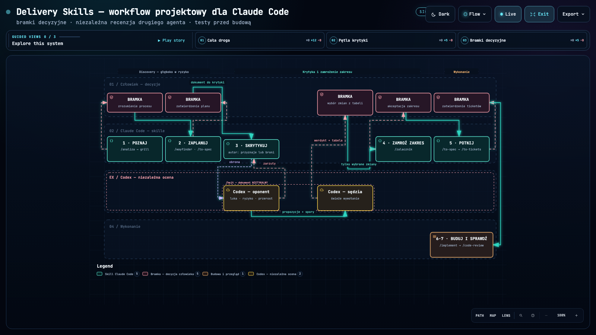
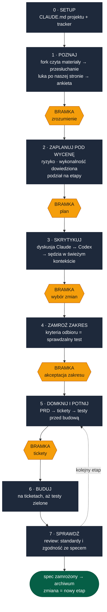
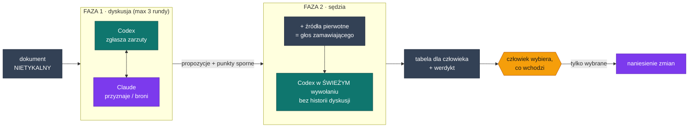

# Delivery Skills — workflow projektowy dla Claude Code

[](https://juliajakubowskabiznes.github.io/delivery-skills/docs/diagrams/workflow.html?theme=dark&present=1)

<p align="center">
  <a href="https://juliajakubowskabiznes.github.io/delivery-skills/docs/diagrams/workflow.html?theme=dark&present=1"><b>Otwórz interaktywną wersję ↗</b></a> ·
  <a href="https://juliajakubowskabiznes.github.io/delivery-skills/docs/diagrams/workflow.html?theme=dark&present=1#view=petla-krytyki">pętla krytyki</a> ·
  <a href="https://juliajakubowskabiznes.github.io/delivery-skills/docs/diagrams/workflow.html?theme=dark&present=1#view=bramki">bramki decyzyjne</a> ·
  <a href="docs/diagrams/workflow.json">źródło diagramu</a>
</p>

**18 skilli dla Claude Code**, które biorą sprawdzony proces inżynierii oprogramowania —
spec-driven development, ADR-y, ubiquitous language, tracer bullets, TDD, dwuosiowy code
review — i dokładają do niego warstwę, której w oryginale nie ma: **weryfikację przez
drugiego agenta**, bramki decyzyjne i mechaniczne hamulce na zgadywanie.

**Stack:** Claude Code (skille + hooki + sub-agenty) · plugin
[Codex](https://github.com/openai/codex-plugin-cc) jako niezależny recenzent ·
issue tracker do wyboru (GitHub / GitLab / lokalny markdown).

---

## Teza

Dobre praktyki inżynierskie są opisane od dawna i działają. Problem w tym, że **agent
kodujący łamie je szybciej, niż człowiek zdąży zauważyć** — i łamie je w sposób, którego
nie widać w wyniku:

- wypełnia luki hipotezami, które w dokumencie wyglądają identycznie jak fakty,
- poprawia zatwierdzone dokumenty „bo tak będzie lepiej", unieważniając zgodę, która za
  nimi stała,
- buduje, zanim ktokolwiek ustalił kryterium, po którym pozna się, że zbudowane jest dobrze,
- **recenzuje własną pracę tą samą ramą, w której ją napisał** — i wystawia sobie zaliczenie.

Sam proces tego nie zatrzyma, bo proces jest tekstem, a tekst w prompcie tonie w długiej
sesji. Zatrzymują to mechanizmy: świeży kontekst, drugi model, hook i bramka. To repo jest
zapisem takiego złożenia — i przykładem tego, jak projektować skille, żeby reguła przeżyła
sesję zamiast utonąć w niej wraz z resztą instrukcji.

## Baza i warstwa własna

**Baza** to open-source'owy zestaw [mattpocock/skills](https://github.com/mattpocock/skills)
(MIT) — uznane praktyki w formie skilli: spec z kryteriami akceptacji, cięcie na wertykalne
plasterki, glosariusz domenowy i ADR-y, TDD przy ustalonych szwach, przegląd kodu na osi
standardów i osi zgodności ze specem.

**Warstwa dołożona** odpowiada na to, czego baza nie adresuje — bo pisana była dla człowieka
prowadzącego agenta, nie dla agenta prowadzącego cały projekt:

| Co dołożone | Na co odpowiada | Gdzie |
|---|---|---|
| **Recenzja drugim agentem** — dyskusja Claude↔Codex, potem sędzia w świeżym wywołaniu | autor nie umie ocenić własnej ramy; recenzent, który zna debatę, dziedziczy ją razem z autorem | [`/hejt`](skills/hejt/SKILL.md) |
| **Fork kontekstu do czytania materiałów** | sesja, która już w coś uwierzyła, czyta materiały pod tę tezę | [`/analiza`](skills/analiza/SKILL.md) |
| **Bramki decyzyjne po każdej fazie** | model nie zna granicy między „poprawiłem drobiazg" a „zmieniłem ustalenie" | [`/workflow`](skills/workflow/SKILL.md) |
| **Hook jako twarda pamięć** | instrukcja w prompcie przestaje działać dokładnie wtedy, gdy sesja jest długa | [`/init-klienta`](skills/init-klienta/SKILL.md) |
| **Zero założeń z jawnym właścicielem pytania** | luka wpisana po cichu jest nieodróżnialna od ustalenia | [`/to-spec`](skills/to-spec/SKILL.md), [`/to-tickets`](skills/to-tickets/SKILL.md) |
| **Rozdzielenie fazy discovery od fazy wykonawczej** | pisanie pełnej specyfikacji, zanim wiadomo, czy rzecz jest wykonalna i opłacalna | [`/workflow`](skills/workflow/SKILL.md) faza 2 vs 5 |
| **Ankieta do interesariusza zamiast domysłu** | wiedza, której nie ma po naszej stronie, nie powstanie przez dłuższe myślenie | [`/to-questionnaire`](skills/to-questionnaire/SKILL.md) |

Skille bazowe też zostały zmodyfikowane — `to-spec`, `to-tickets` i `to-questionnaire`
dostały polskie sekcje, regułę zera założeń, routing pytań do interesariusza i drabinkę
cel → metryka → kryterium odbioru.

## Spis treści

- [Teza](#teza)
- [Baza i warstwa własna](#baza-i-warstwa-własna)
- [Jak to jest zrobione pod spodem](#jak-to-jest-zrobione-pod-spodem)
- [Workflow — 7 faz](#workflow--7-faz)
- [Katalog skilli](#katalog-skilli)
- [Rola pluginu Codex](#rola-pluginu-codex)
- [Wzorce projektowania skilli](#wzorce-projektowania-skilli)
- [Szybki start](#szybki-start)
- [Struktura folderów projektu](#struktura-folderów-projektu)
- [Co dopasować pod siebie](#co-dopasować-pod-siebie)
- [Pochodzenie i licencja](#pochodzenie-i-licencja)

Głębsze opisy: [`docs/`](docs/) — [workflow](docs/01-workflow.md) ·
[skille procesowe](docs/02-skille-wdrozeniowe.md) ·
[skille inżynierskie](docs/03-skille-inzynierskie.md) ·
[struktura folderów](docs/04-struktura-folderow.md) ·
[instalacja i konfiguracja](docs/05-instalacja-i-konfiguracja.md)

## Jak to jest zrobione pod spodem

Implementacja tego, co wyżej opisane funkcjonalnie — konkrety, które decydują o tym, czy
reguła zadziała, czy tylko ładnie brzmi:

| Mechanizm | Implementacja |
|---|---|
| **Fork kontekstu** | frontmatter `context: fork` w [`/analiza`](skills/analiza/SKILL.md) — skill wykonuje się bez historii rozmowy, więc czyta materiały bez tezy, którą sesja zdążyła przyjąć. Raport ląduje w pliku, nie tylko w rozmowie: przeżywa restart sesji |
| **Sędzia bez wspólnej ramy** | druga faza [`/hejt`](skills/hejt/SKILL.md) to *nowe* wywołanie Codexa, które dostaje dokument, listę sporów i ścieżki do źródeł — nigdy historii dyskusji. Ciężkie wywołania w `--background`, bo kilkuminutowe rozumowanie nie mieści się w timeoucie Bash |
| **Hook jako twarda pamięć** | `PostToolUse` na `Write\|Edit` w `.claude/settings.json` projektu; przy zapisie do spec/PRD/CLAUDE.md wychodzi z **kodem 2**, więc agent musi się zatrzymać i pokazać propozycję. Działa niezależnie od tego, ile sesja pamięta |
| **Sub-agenty równoległe** | [`/code-review`](skills/code-review/SKILL.md) uruchamia dwie osie w osobnych kontekstach i **nie scala raportów**; research odpala jednego agenta na pytanie badawcze (min. 2 źródła z linkami); `design-it-twice` — 3+ wariantów interfejsu naraz |
| **Tracker jako abstrakcja** | skille czytają `docs/agents/issue-tracker.md` zamiast zakładać platformę — ta sama instrukcja działa na GitHubie (`gh`), GitLabie (`glab`) i na plikach markdown w `.scratch/` |
| **EARS jako kontrakt testowy** | kryteria pisane wzorcami (`GDY <zdarzenie>, system MUSI X`) konwertują się 1:1 na testy. Twarda reguła: każdy krok czytający dane przez AI musi mieć kryterium typu „JEŚLI odczyt zawiedzie" — cicha zła odpowiedź to najgorsza klasa awarii |
| **Progresywne ładowanie reguł** | krótki kręgosłup w `SKILL.md`, szczegóły w [`references/`](skills/workflow/references/) doczytywane przy wejściu w fazę. Regulamin wpakowany do jednego pliku wypada z kontekstu dokładnie wtedy, gdy jest potrzebny |

## Workflow — 7 faz

Stała kolejność, bramka po każdej fazie. Agent melduje pozycję: `[WORKFLOW faza N/7 — NAZWA]`.

**Słownik:** *zamawiający* to strona, która zamawia i odbiera — klient zewnętrzny, dział
biznesowy albo product owner. *Etap* to porcja pracy, którą da się odebrać osobno.
Nazwy skilli zostały z domeny, w której to powstało (projekty wdrożeniowe u klientów),
ale mechanika jest domenowo obojętna.

| # | Faza | Co się dzieje | Efekt | Bramka |
|---|---|---|---|---|
| 0 | **Setup** | raz na projekt: CLAUDE.md projektu + tracker zadań | pamięć projektu | — |
| 1 | **Poznaj** | fork czyta wszystkie materiały, potem przesłuchanie człowieka; czego nie wie nikt po naszej stronie → ankieta do zamawiającego | raport + decyzje + pytania | 🚧 potwierdzenie zrozumienia |
| 2 | **Zaplanuj pod wycenę** | ryzyko, wykonalność **dowiedziona na realnych danych**, podział na etapy, które da się odebrać osobno | plan całości | 🚧 zatwierdzenie planu |
| 3 | **Skrytykuj** | dyskusja dwóch modeli → świeży sędzia rozstrzyga spory i robi własny research | tabela propozycji + werdykt | 🚧 wybór zmian |
| 4 | **Zamroź zakres** | zakres językiem zamawiającego, kryteria odbioru = sprawdzalny test (w wariancie komercyjnym: umowa + załącznik) | uzgodniony zakres | 🚧 akceptacja przed wysyłką |
| 5 | **Domknij i potnij** | *dopiero po zamrożeniu zakresu*: PRD, cięcie na zadania z zależnościami, **testy przed budową** | PRD + tickety + testy | 🚧 zatwierdzenie ticketów |
| 6 | **Buduj** | realizacja na ticketach, aż testy zielone, potem upraszczanie | działający krok | — |
| 7 | **Sprawdź** | przegląd na dwóch osiach równolegle: standardy i zgodność ze specem | raport | — |



<sub>Diagram powyżej to wersja tekstowa (mermaid), edytowalna w diffie. Wersja
interaktywna — z prowadzonymi widokami i trybem prezentacji — jest
[tutaj](https://juliajakubowskabiznes.github.io/delivery-skills/docs/diagrams/workflow.html?theme=dark&present=1),
a jej typowane źródło leży w [`docs/diagrams/workflow.json`](docs/diagrams/workflow.json).</sub>

**Bramka nie jest checkpointem do odklikania** — to miejsce, w którym agent nie ma prawa
kontynuować bez decyzji człowieka. Wszystko po lewej stronie bramki jest propozycją,
wszystko po prawej — ustaleniem.

**Głęboko przed wyceną, płytko przed budową.** Faza 2 dowodzi wykonalności — najlepiej
testem na prawdziwych danych — ale nie schodzi do kontraktów danych i kolejności budowy.
To robi PRD w fazie 5, po zamrożeniu zakresu. Rozdzielenie discovery od wykonania jest tu
regułą procesu, nie kwestią stylu: specyfikacja napisana przed dowodem wykonalności bywa
specyfikacją rzeczy, której nie da się zbudować.

Po odbiorze spec idzie do archiwum jako **zamrożony zapis ustaleń** — nie aktualizuje się
go, gdy system się zmienia. Zmiana = nowy etap.

**Test wagi:** drobiazg bez nowych decyzji architektonicznych omija całą ścieżkę — od razu
budowa, test, przegląd. Wielki spec do 20-minutowej roboty to strata, nie staranność.

Pełny opis faz, z uzasadnieniem każdej reguły: [`docs/01-workflow.md`](docs/01-workflow.md).

## Katalog skilli

**Skille procesowe** (napisane pod ten workflow, po polsku) —
szczegóły: [`docs/02-skille-wdrozeniowe.md`](docs/02-skille-wdrozeniowe.md)

| Skill | Faza | Co robi |
|---|---|---|
| [`/workflow`](skills/workflow/SKILL.md) | cały proces | kręgosłup: kolejność faz, bramki, routing do pozostałych skilli |
| [`/init-klienta`](skills/init-klienta/SKILL.md) | 0 | zakłada CLAUDE.md projektu (pamięć) + hook pilnujący bramek |
| [`/analiza`](skills/analiza/SKILL.md) | 1 | fork czyta cały folder projektu → raport: co wiemy, sprzeczności, luki |
| [`/to-questionnaire`](skills/to-questionnaire/SKILL.md) | 1, 5 | zamienia „tego nie wiemy" w jedną ankietę async, bez spotkania |
| [`/hejt`](skills/hejt/SKILL.md) | 3 | krytyka: dyskusja Claude↔Codex → świeży sędzia → tabela propozycji |
| [`/zalacznik`](skills/zalacznik/SKILL.md) | 4 | zakres do zamrożenia, językiem zamawiającego, z kryteriami odbioru, które da się sprawdzić |
| [`/to-spec`](skills/to-spec/SKILL.md) | 2, 5 | zamienia rozmowę w PRD z kryteriami EARS (każde = 1 test) |
| [`/to-tickets`](skills/to-tickets/SKILL.md) | 5 | tnie PRD na zadania „tracer bullet" z jawnymi zależnościami |

**Skille inżynierskie** (baza open-source, po angielsku) —
szczegóły: [`docs/03-skille-inzynierskie.md`](docs/03-skille-inzynierskie.md)

| Skill | Do czego |
|---|---|
| [`/wayfinder`](skills/wayfinder/SKILL.md) | mapa dużego przedsięwzięcia jako tickety decyzyjne — jedna sesja, jeden ticket |
| [`/grilling`](skills/grilling/SKILL.md) | przesłuchanie: jedno pytanie na raz, zawsze z rekomendowaną odpowiedzią |
| [`/grill-with-docs`](skills/grill-with-docs/SKILL.md) | to samo + zapis słownika i decyzji (ADR) w locie |
| [`/domain-modeling`](skills/domain-modeling/SKILL.md) | budowanie języka projektu (CONTEXT.md) i decyzji architektonicznych |
| [`/codebase-design`](skills/codebase-design/SKILL.md) | słownik głębokich modułów: moduł, interfejs, szew, adapter, dźwignia |
| [`/improve-codebase-architecture`](skills/improve-codebase-architecture/SKILL.md) | skan kodu pod refaktory + raport HTML z diagramami przed/po |
| [`/tdd`](skills/tdd/SKILL.md) | red-green-refactor: szwy, antywzorce, kiedy wolno mockować |
| [`/implement`](skills/implement/SKILL.md) | budowa na podstawie specu lub ticketów |
| [`/code-review`](skills/code-review/SKILL.md) | przegląd diffa na dwóch osiach równolegle, bez scalania wyników |
| [`/setup-matt-pocock-skills`](skills/setup-matt-pocock-skills/SKILL.md) | konfiguracja repo: tracker, etykiety triage, dokumenty domenowe |

## Rola pluginu Codex

Drugi model nie jest tu ozdobą — jest **jedynym miejscem, w którym ocena nie pochodzi
od autora ocenianego tekstu**. Claude pisze plan i PRD, więc jego recenzja tych
dokumentów jest recenzją własną.

[`/hejt`](skills/hejt/SKILL.md) używa Codexa dwa razy, w dwóch różnych rolach:

1. **Oponent** (faza dyskusji, max 3 rundy) — zgłasza konkretne zarzuty: luka, ryzyko,
   przerost, nieaktualne narzędzie. Claude jako autor albo przyznaje rację (→ propozycja
   zmiany), albo broni jednym zdaniem (→ punkt sporny).
2. **Sędzia** (nowe wywołanie, **bez historii dyskusji**) — dostaje wyłącznie dokument,
   listy propozycji i sporów, kontekst projektu i **źródła pierwotne = głos zamawiającego**
   (jego transkrypcje i wiadomości; nasze drafty źródłem nie są). Rozstrzyga każdy punkt,
   sprawdza zgodność planu z tym, co zamawiający faktycznie powiedział — z cytatem — i robi
   własny research aktualnych praktyk z linkami.



Codex czyta pliki sam, w sandboksie read-only, więc dostaje ścieżki zamiast wklejek.
Wariantowo przejmuje też budowę ([`references/budowa.md`](skills/workflow/references/budowa.md)):
`codex exec -s workspace-write`, przy czym nie dotyka `.env`, `CLAUDE.md` ani plików
z sekretami, a Claude przechodzi wtedy do recenzji diffa.

**Instalacja:**

```
/plugin marketplace add openai/codex-plugin-cc
/plugin install codex@openai-codex
```

Bez pluginu skille działają dalej — `/hejt` wykonuje obie fazy sam i **jawnie oznacza
wynik jako „ocena własna, nie niezależna"**, zamiast udawać niezależność.

**Operacyjnie:** ciężkie wywołania idą w `--background`. Zadanie na kilka minut myślenia
nie mieści się w timeoucie Bash, a zabity proces zostawia blokadę „task still running",
której plugin nie sprząta (zdejmuje ją `codex-companion.mjs cancel`).

## Wzorce projektowania skilli

Rzeczy, które okazały się ważniejsze od treści samych instrukcji:

- **Reguła, która musi zadziałać, nie może być zdaniem w prompcie.** Stąd hook: mechaniczny,
  odpalany przy każdym zapisie, obojętny na to, ile sesja pamięta.
- **Świeży kontekst jako narzędzie.** Fork do czytania materiałów, świeże wywołanie do
  sądzenia, osobne sub-agenty do dwóch osi przeglądu. Za każdym razem chodzi o to samo:
  nie dziedziczyć ramy, którą się właśnie ocenia.
- **Bramka zamiast zaufania.** Model nie zna granicy między „poprawiłem drobiazg"
  a „zmieniłem ustalenie". Granicę rysuje proces: zatwierdzony dokument zmienia się
  wyłącznie przez tabelę ZA/PRZECIW i wybór człowieka.
- **Widoczna niewiedza.** Sekcja „Nierozstrzygnięte pytania" z właścicielem przy każdym
  pytaniu; `[DO POTWIERDZENIA → pyt. N]` w treści; „brak" wpisywane jawnie, bo pusta
  sekcja to twierdzenie, nie przeoczenie.
- **Instrukcja mówi, czego NIE robić, i podaje powód.** Reguła bez uzasadnienia jest
  pierwszą, którą model zracjonalizuje — więc każda ma przy sobie zdanie „bo inaczej…".

## Szybki start

```bash
# 1. Skille do projektu (albo globalnie: ~/.claude/skills/)
cp -R skills/* /ścieżka/do/projektu/.claude/skills/

# 2. Opcjonalnie: niezależny recenzent
#    /plugin marketplace add openai/codex-plugin-cc
#    /plugin install codex@openai-codex

# 3. W Claude Code, w folderze projektu:
#    /init-klienta <ścieżka do folderu projektu>   # zakłada CLAUDE.md + hook
#    /workflow
```

Dalej mówisz do agenta normalnym językiem — „przeanalizuj materiały", „zrób plan pod
wycenę", „skrytykuj to", „potnij na zadania". Nazwy skilli są po stronie agenta.
Szczegóły: [`docs/05-instalacja-i-konfiguracja.md`](docs/05-instalacja-i-konfiguracja.md).

## Struktura folderów projektu

Skille zakładają porządek pilnowany mechanicznie, nie z pamięci:

1. **Numerowane podfoldery, zero luźnych plików.** Prefiks (`00_`, `01_`…) wymusza
   kolejność; po usunięciu czegoś numeracja jest przenumerowywana, żeby nie było dziur.
2. **Jedno archiwum.** Dokument nieaktualny idzie do `99_archiwum/` **od razu, w tej samej
   sesji**, z dopiskiem `_STARY`. Foldery robocze pokazują wyłącznie aktualny stan — inaczej
   każda kolejna sesja zaczyna się od śledztwa, która wersja obowiązuje.
3. **Jedno miejsce na linki.** Wszystkie adresy zewnętrzne w jednej tabeli w CLAUDE.md
   projektu; inne pliki *odsyłają*, nigdy nie kopiują URL-a.

Pełny wzorzec, z anatomią folderu faza po fazie: [`docs/04-struktura-folderow.md`](docs/04-struktura-folderow.md).

## Co dopasować pod siebie

| Miejsce | Co zmienić |
|---|---|
| `skills/analiza`, `skills/to-spec`, `skills/to-questionnaire` | ścieżki zapisu (`<folder projektu>/<etap>/03_planowanie/`) |
| `skills/hejt`, `skills/workflow/references/budowa.md` | drugi model — domyślnie Codex; warunek merytoryczny: sędzia dostaje świeży kontekst |
| `skills/zalacznik` | miejsce docelowe umowy (domyślnie dokument w chmurze, nie repo) |
| `skills/init-klienta` | szablon CLAUDE.md i treść hooka |
| `skills/setup-matt-pocock-skills` | tracker i etykiety triage |

Skille procesowe są po polsku (produkują dokumenty dla polskiego zamawiającego),
inżynierskie po angielsku. Instrukcja dla modelu nie musi być w języku dokumentu, który powstaje —
można ujednolicić w obie strony.

## Pochodzenie i licencja

Skille inżynierskie wyrosły z open-source'owego zestawu
[mattpocock/skills](https://github.com/mattpocock/skills) (MIT) i zostały zmodyfikowane —
zakres zmian opisuje sekcja [Baza i warstwa własna](#baza-i-warstwa-własna).
Warstwa procesowa (`workflow`, `analiza`, `hejt`, `zalacznik`, `init-klienta`) powstała
pod ten workflow.

Interaktywny diagram wyrenderowany przez [Archify](https://github.com/tt-a1i/archify) (MIT)
z typowanego źródła w [`docs/diagrams/workflow.json`](docs/diagrams/workflow.json).

Licencja: MIT (patrz [`LICENSE`](LICENSE)).
